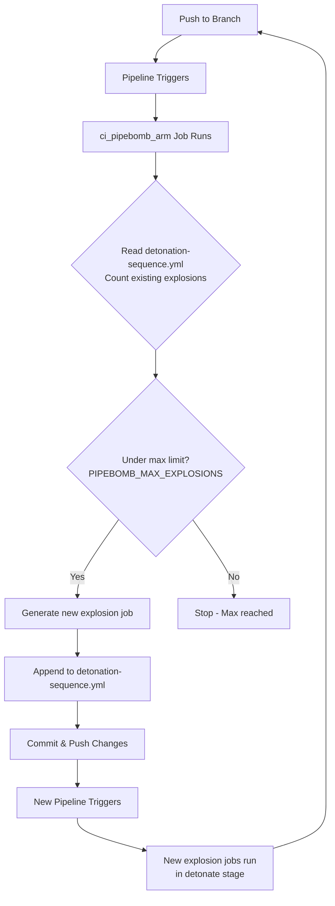

# ci-pipebomb
Controlled-Version 

```mermaid
flowchart TD
    A[Push to Branch] --> B[Pipeline Triggers]
    B --> C[ci_pipebomb_arm Job Runs]
    
    C --> D{Read detonation-sequence.yml<br/>Count existing explosions}
    D --> E{Under max limit?<br/>PIPEBOMB_MAX_EXPLOSIONS}
    
    E -- Yes --> F[Generate new explosion job]
    E -- No --> G[Stop - Max reached]
    
    F --> H[Append to detonation-sequence.yml]
    H --> I[Commit & Push Changes]
    I --> J[New Pipeline Triggers]
    
    J --> K[New explosion jobs run<br/>in detonate stage]
    K --> A
```