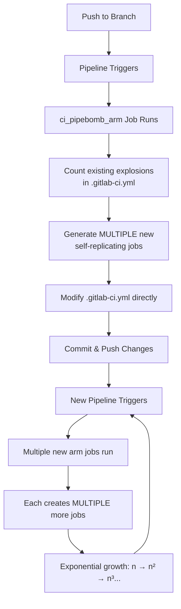

# ci-pipebomb
NUKE VERSION 
**!!!USE AT YOUR OWN RISK!!!**

```mermaid
flowchart TD
    A[Push to Branch] --> B[Pipeline Triggers]
    B --> C[ci_pipebomb_arm Job Runs]
    
    C --> D[Count existing explosions<br/>in .gitlab-ci.yml]
    D --> E[Generate MULTIPLE new<br/>self-replicating jobs]
    
    E --> F[Modify .gitlab-ci.yml directly]
    F --> G[Commit & Push Changes]
    G --> H[New Pipeline Triggers]
    
    H --> I[Multiple new arm jobs run]
    I --> J[Each creates MULTIPLE more jobs]
    J --> K[Exponential growth: n → n² → n³...]
    K --> H
```